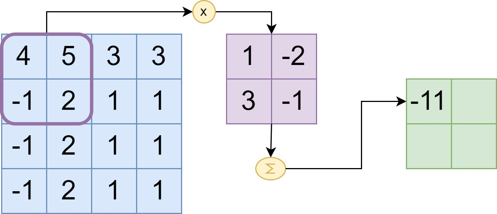
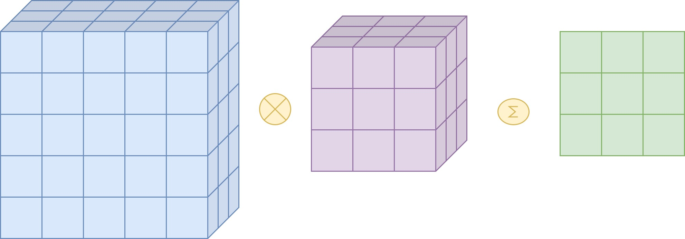

# Convolution

## What is convolution?

In the context of convolutional models, convolution refers to a mathematical operation that is performed on two functions to produce a third function. In the case of convolutional neural networks (CNNs), this operation is used to process input data, such as images, in order to extract meaningful features.

At its core, convolution involves sliding a small window, called a kernel or filter, across the input data. The kernel is usually a small matrix of weights. Each position of the kernel corresponds to a specific element in the input data, and the weights in the kernel determine the contribution of that element to the output.

As the kernel slides across the input, it performs a dot product between its weights and the values in the region of the input it is currently positioned on. This dot product is then summed up to produce a single value, which becomes the corresponding element in the output feature map. The process is repeated for each position of the kernel until the entire input has been covered.

The key idea behind convolutional neural networks is that the kernels used in the convolution operation are learned through training. This means that the network learns to automatically determine the best weights for each kernel, enabling it to extract relevant features from the input data.

Convolutional layers are typically stacked in CNNs, allowing the network to learn increasingly complex features as information flows through the layers. The outputs of one convolutional layer are often passed through non-linear activation functions, such as ReLU, to introduce non-linearity into the model.

Convolutional models have been highly successful in various computer vision tasks, such as image classification, object detection, and image segmentation, due to their ability to capture local patterns and spatial relationships in the input data.

## A simple example

Let's illustrate how convolution is performed on a 5x1 2D array using a 3x1 kernel. Here's an example:

***Step 1***


***Step 2***


***Step 3***


## Using convolution for finding patterns


## Stride

In the context of neural networks, stride refers to the step size or the amount of movement applied to the sliding window (kernel) during the convolution operation. It determines how much the window is shifted after each convolution operation.

When performing convolution, the stride value determines how much the window moves horizontally and vertically across the input data. A stride of 1 means that the window moves one step at a time, resulting in overlapping receptive fields. A larger stride value, such as 2, means that the window skips positions and moves two steps at a time, resulting in non-overlapping receptive fields.

The main implications of stride in neural networks are:

Output spatial dimensions: The stride value affects the spatial dimensions of the output feature map. As the stride increases, the output size decreases because the window covers fewer positions of the input data. The relationship between the input size (height and width), kernel size, stride, and output size is given by the following formula:

```python
output_height = (input_height - kernel_height) / stride + 1
output_width = (input_width - kernel_width) / stride + 1
```

Information preservation: Larger stride values result in a loss of information compared to smaller stride values. With a larger stride, the window skips positions, and the receptive fields of the output feature map do not overlap as much with the input data. This can lead to a coarser representation of the input and potentially loss of fine-grained details.

Computational efficiency: Using a larger stride can reduce the computational cost of the convolution operation. With a larger stride, fewer positions need to be processed, reducing the number of multiplications and additions required. This can be beneficial in terms of memory usage and computational efficiency, especially in models with large input sizes or complex architectures.

It's worth noting that adjusting the stride is closely related to the concept of padding. When the stride is greater than 1, the output size decreases, and it may not cover the entire input size. In such cases, padding can be used to retain the spatial dimensions of the input and ensure that the output feature map covers the entire input.

Stride is a hyperparameter that can be tuned during the design of a neural network architecture. The choice of stride value depends on various factors, including the nature of the problem, the size of the input data, and the desired output resolution.

***Example***


## Padding

Padding is a technique used in convolutional neural networks (CNNs) to adjust the size of the input data and the output feature maps during the convolution operation. It involves adding extra rows and columns of zeros around the input data before performing the convolution.

The main reasons for using padding are:

**Preserve spatial dimensions**: Convolution reduces the spatial dimensions of the input data. By adding padding, we can retain the spatial dimensions of the input and output feature maps. This can be important in cases where the spatial information is critical, such as in image segmentation or object localization tasks.

**Mitigate border effects**: When convolving a kernel over the edges of the input data, the resulting output feature map may be smaller than the input. This can lead to the loss of information at the borders. Padding helps mitigate this issue by providing additional context around the edges, allowing the convolutional operation to be performed more accurately.

***Example***


## Pooling

Pooling is a down-sampling operation commonly used in convolutional neural networks (CNNs) to reduce the spatial dimensions of the feature maps generated by the convolutional layers. It helps in simplifying and abstracting the learned representations while retaining the most important information.

There are different types of pooling operations, but the two most common ones are max pooling and average pooling:

Max Pooling: Max pooling divides the input feature map into non-overlapping rectangular regions (pools) and outputs the maximum value within each pool. By taking the maximum value, max pooling retains the most activated or dominant features within each pool. It helps in capturing the presence of certain features regardless of their exact location, making the network more robust to translations and local variations. Max pooling reduces the spatial dimensions of the feature maps while preserving the most salient information.

Average Pooling: Average pooling is similar to max pooling, but instead of taking the maximum value within each pool, it calculates the average value. Average pooling is useful when the magnitude or intensity of the features is important rather than their specific locations. It can help in reducing the noise or variations in the feature maps and can be used as an alternative to max pooling in some cases.

Pooling brings several benefits to CNNs:

Dimensionality reduction: Pooling reduces the spatial dimensions of the feature maps, which can help in reducing the computational complexity of the network. By reducing the number of parameters and computations, pooling enables more efficient training and inference.

Translation invariance: Max pooling, in particular, helps in capturing the presence of important features regardless of their exact location. This translation invariance property makes CNNs more robust to variations in object position, rotation, or scale within an image.

Feature abstraction: Pooling helps in abstracting the representations learned by the convolutional layers. By summarizing the most important or activated features within each pool, pooling operations capture higher-level patterns and reduce the sensitivity to local variations or noise.

It's worth noting that pooling is typically applied after the convolutional layers in a CNN, and it is often used in conjunction with convolution to down-sample and abstract the feature maps. The choice of pooling operation and its parameters (such as pool size and stride) depends on the specific problem and network architecture.

## Using multiple Kernels

When performing convolution with multiple kernels, also known as multi-channel convolution, each kernel corresponds to a separate feature map in the output. The process involves convolving each kernel with the input data independently and producing a separate feature map for each kernel.


## Using multiple convolution layers

TODO

## 2D convolutions

Convolution can also be performed with 2D matrices. In fact, convolution with 2D matrices is a fundamental operation in image processing and computer vision tasks.

When performing convolution with 2D matrices, the process is very similar to the convolution with 1D arrays or 2D arrays. Instead of using a 1D kernel or a 2D kernel, a 2D convolution involves using a 2D filter or kernel to slide over the input matrix and perform element-wise multiplication followed by summation.

Here's an example to illustrate 2D convolution with matrices:



## 3D Tensor convolutions



### 3D Tensor convolution with multiple kernels


## Convolutional Neural networks

A convolutional neural network (CNN) is a type of deep learning network that is particularly effective for processing grid-like data, such as images or sequences. CNNs are designed to automatically learn hierarchical representations of patterns and features directly from the input data.

In a CNN, the convolutional layers are responsible for extracting local patterns and features from the input. These layers consist of multiple filters or kernels that slide over the input data, performing convolution operations to produce feature maps. Convolutional layers are effective in capturing spatial relationships and detecting local patterns, such as edges or textures.

Now, let's discuss the components of the prediction head in a CNN:

Flatten Layer: The flatten layer is used to convert the multi-dimensional feature maps from the convolutional layers into a single vector. It reshapes the output from the convolutional layers into a flat or one-dimensional tensor. This is necessary because the subsequent layers in the prediction head, such as fully connected or linear layers, expect a one-dimensional input. The flatten layer essentially "flattens" the spatial information into a feature vector, while preserving the learned representations.

Linear Layer: The linear layer, also known as a fully connected layer or dense layer, is a type of neural network layer where each neuron is connected to every neuron in the previous layer. The linear layer performs a linear transformation on the input data by applying a matrix multiplication followed by a bias term. It learns to map the input features to a higher-dimensional space, enabling the network to capture complex relationships between the features. The linear layer can be thought of as a feature extractor that maps the flattened input to an intermediate representation.

Softmax Layer: The softmax layer is typically the final layer in the prediction head of a classification CNN. It applies the softmax function to the outputs of the previous linear layer. The softmax function normalizes the output values, transforming them into a probability distribution over the different classes in a multi-class classification problem. The output values represent the predicted probabilities for each class, and they sum up to 1. The class with the highest probability is typically considered as the predicted class by the model.

In summary, the flatten layer is used to reshape the output from the convolutional layers into a one-dimensional vector. The linear layer performs a linear transformation on the flattened features, mapping them to an intermediate representation. Finally, the softmax layer applies the softmax function to produce class probabilities for multi-class classification.

These components collectively form the prediction head of a CNN, which takes the learned representations from the convolutional layers and transforms them into predictions for a specific task, such as image classification.


## Which CNNs do exist?

The honest answer to the question "How many CNN architectures exist" would be "possible more than one million". Everyone can implement his or her own CNN architecture. But there are a few number of models that have proofen to work good in real life use cases. I will give you a short introduction to three of these models:

***VGG***
VGG is a classical convolutional neural network that was introduced in 2015 in the paper <a href="https://arxiv.org/pdf/1409.1556.pdf" target="_blank">Very Deep Convolutional Networks for large-scale Image recognition</a> and outperformed previous existing architectures. The VGG model comes in different sizes starting with the smallest variant named VGG11 and ending with the largest model named VGG19. Its benefits are that its architecture is easy to understand as it only consists of layers that we have discussed in this course. But its downsides are that the model has a lot of parameters which makes training harder. The largest variant VGG19 nearly uses 500MB disk space on a device.

Paper: <a href="https://arxiv.org/pdf/1409.1556.pdf" target="_blank">Very Deep Convolutional Networks for large-scale Image recognition</a>

PyTorch: <a href="https://pytorch.org/vision/stable/models/vgg.html" target="_blank">VGG Models</a>

***MobileNet***
The idea of MobileNet was to develop a small model that reaches high accuracies in image classification tasks. The advantages of MobilNet are that it is very small (10MB - 20MB) but still reaches good results in image classification tasks. It is so small that you even could train it on a CPU with a small image dataset. MobileNet was improved during the last years, so the current version of MobileNet is version 3. Also mobilnet comes in four different sizes. Check them out on PyTorch.

Paper: <a href="https://arxiv.org/pdf/1905.02244.pdf" target="_blank" />Searching for mobileNet V3</a>

PyTorch: <a href="https://pytorch.org/vision/main/models/mobilenetv3.html" target="_blank">VGG Models</a>


***ResNet***

ResNet is one of the most popular models in the computer vision domain. It was introduced in 2015 by microsoft and drives multiple famous model architectures for classification, object decetion and image segmentation. ResNet also comes in different sizes starting with ResNet18, continuing with ResNet34, Resnet50, ResNet101, and ending with ResNet 152. Especially ResNet50 is also used for other tasks than image classification such as object detection in the <a href="https://pytorch.org/vision/main/models/faster_rcnn.html" target="_blank">Faster-RCNN</a> model, for image segmenation in the <a href="https://pytorch.org/vision/main/models/mask_rcnn.html" target="_blank">Mask-R-CNN</a> model or for keypoint detection in the <a href="https://pytorch.org/vision/main/models/keypoint_rcnn.html" target="_blank">Keypoint-R-CNN</a> model

Paper: <a href="https://arxiv.org/pdf/1512.03385.pdf" target="_blank" />Deep Residual Learning for Image Recognition</a>


## More PyTorch Vision Models

You can get an overview of the (pretrained) computer vision models available in PyTorch here:

- <a href="https://pytorch.org/vision/main/models/mask_rcnn.html" target="_blank">Image Classification</a>
- <a href="https://pytorch.org/vision/main/models.html#object-detection" target="_blank">Object Detection</a>
- <a href="https://pytorch.org/vision/main/models.html#keypoint-detection" target="_blank">Keypoint Detection</a>
- <a href="https://pytorch.org/vision/main/models.html#instance-segmentation" target="_blank">Instance Segmentation</a>
- <a href="https://pytorch.org/vision/main/models.html#semantic-segmentation" target="_blank">Semantic Segmentation</a>
- <a href="https://pytorch.org/vision/main/models.html#video-classification" target="_blank">Video Classification</a>


## Papers:

If you are interested into diving deeper into convolution in neural networks I highly recommend this paper: https://arxiv.org/pdf/1603.07285.pdf
