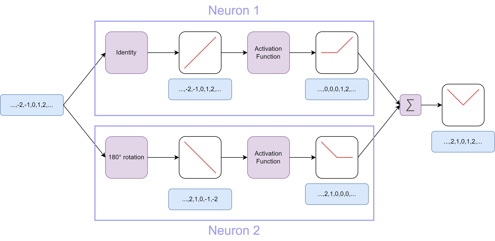
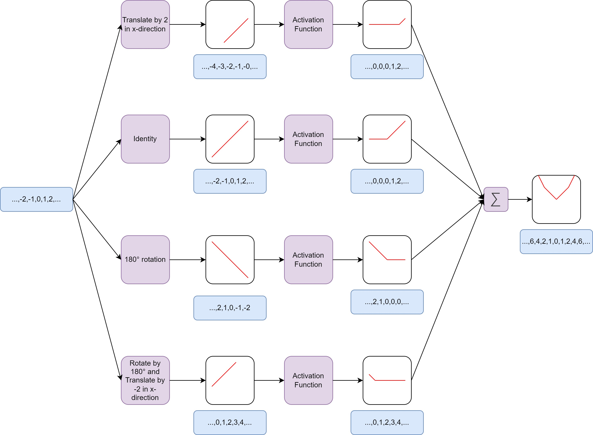
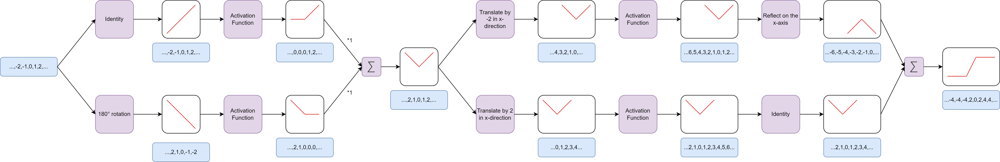

# Neural Networks

## What is a neuron?

In the context of neural networks, a neuron, also known as a node or unit, is a fundamental building block that emulates the functionality of a biological neuron in the human brain. Neurons are interconnected to form artificial neural networks, which are computational models designed to mimic certain aspects of human brain function.

At its core, a neuron in a neural network receives input signals, processes them, and produces an output signal. The input signals are weighted and summed, and then passed through an activation function to generate the output. The activation function introduces non-linearity into the neuron's response, enabling neural networks to learn complex patterns and make non-linear predictions.

A neuron typically has the following components:

**_Input signals_**: Neurons receive input signals from other neurons or external sources. Each input connection is associated with a weight that determines the strength or importance of the input signal.

**_Weights_**: Weights are numerical values assigned to the input connections. They represent the significance of each input in influencing the neuron's output. Mostly we represent these weights as matrices. The input signals are then multiplied with these weight matrices in a neuron. The result is a geometric transformation of the input signal. Neurons can rotate, reflect or shift input signals or mix multiple of these transformations. During training, neural networks adjust the weights (and so the matrices) to optimize the network's performance.

**_Activation function_**: The sum of the weighted inputs is passed through an activation function, which determines the neuron's output based on the input. Common activation functions include sigmoid, tanh, ReLU, and Leky ReLU.

**_Summation function_**: The weighted inputs are summed together, typically using a linear operation like addition.

## What can you do with multiple neurons?

As each neuron predicts a simple function, multiple neurons can predict more complex functions. The functions each neuron predicts are summed together. If we want to approximate the function `f(x)=x^2` with a neural network with two neurons and a ReLU activation function we could do this like shown in the diagram below. The input signal is a linear function of the form `f(x) = x`. This function is first run through the weight matrices of the neurons. The first neuron doesn't change the input signal, which means the matrix multiplied with the input signal is the identity matrix. The second neuron rotates the input signal by 180° which can be done using a rotation matrix. Both signals are then run through the ReLU activation functions which eliminates all negative values and maps them to zero. Finally we sum both functions and get an approximation of a parabola. This does not exactly look like the true function, but it is the closest approximation we can get with two neurons.

## Better approximation with more neurons

The approximation we achieved with two neurons doesn't look like a parabola. We want to get a more accurate approximation. This can be done by increasing the number of neurons. The number of neurons is increased to four. The first added neuron translates the input signal by 2 on the x-axis and then runs the translated funcition through a ReLU activation function. The other added neuron translates the input signal by -2 on the x-axis and also runs this signal through a ReLU activation function. When we sum all of these four functions created by the neurons we get a resulting function that looks more like a parabola.

## What can you do multiple layers of neurons?

Let's build a more complex network with multiple layers to approximate the sigmoid function. The first layer of neurons works exactly like in our previous example. It has two neurons and outputs an approximation of a parabola. This parabola is then the input signal of the second layer of neurons. You see a fundamental concept of deep neural networks here. The second layer get's a more complex input signal as the first layer of neurons. Each layer of neurons adds more complexity to the input signals. The first neuron of the second layer reflects the parabola approximation on the x-axis and translates it to the right. The second neuron of the second layer translates the parabola approximation to the left. The third layer (which has no activation functions as you see in the diagram) takes the parabola approximation that has been translated to the right and reflects it on the x-axis. The other parabola that was translated to the left isn't changed. It then sums both functions and the result is a function that looks like logistic function.

## How do you find the best parameters?

We have seen that neural networks are basically function approximators where each neuron learns a simple function. All learned functions of the neurons are then summed together and fed to the next layer of neurons. Each layer can add more complexity to the resulting function which makes it possible for neural networks to learn very complex patterns. Here is a video that explains why neural networks (almost) can learn anything:

<iframe width="560" height="315" src="https://www.youtube.com/embed/0QczhVg5HaI?si=0mNP6zIX4fOgOech" title="YouTube video player" frameborder="0" allow="accelerometer; autoplay; clipboard-write; encrypted-media; gyroscope; picture-in-picture; web-share" allowfullscreen></iframe>

But how do we find the best parameters alias the best transformation operators for our neural networks? As neural networks size grows it get's impossible to try all combination of parameters or even design the operators by hand. There has to be a better solution, and this solution is an algorithm named **_Gradient Descent_**. We will have a look at this algorithm in the next lesson.
