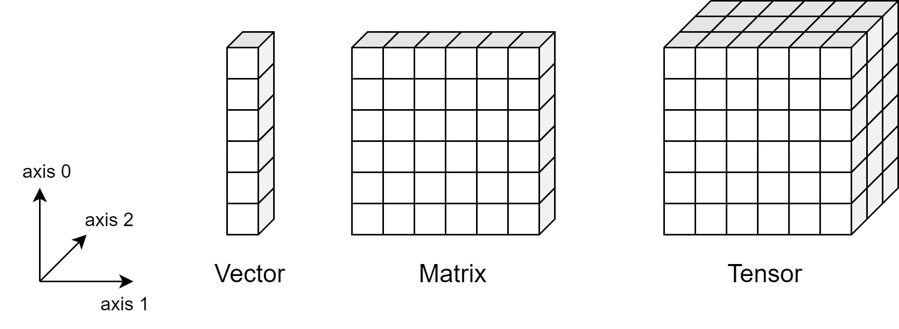
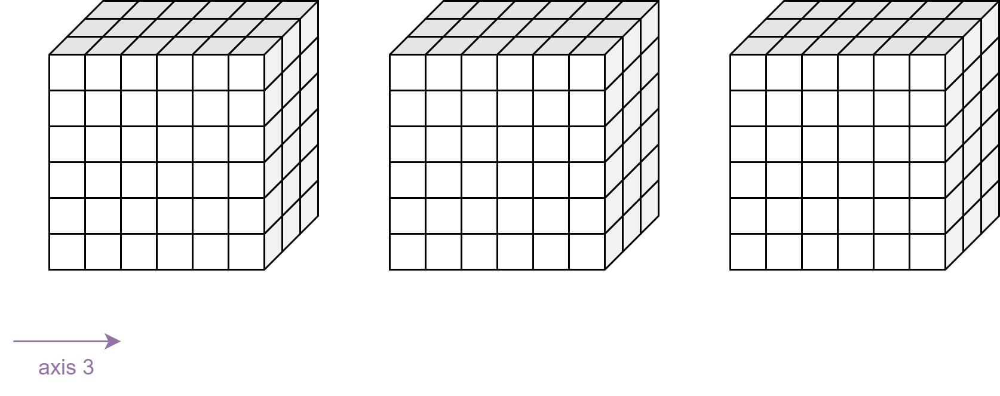
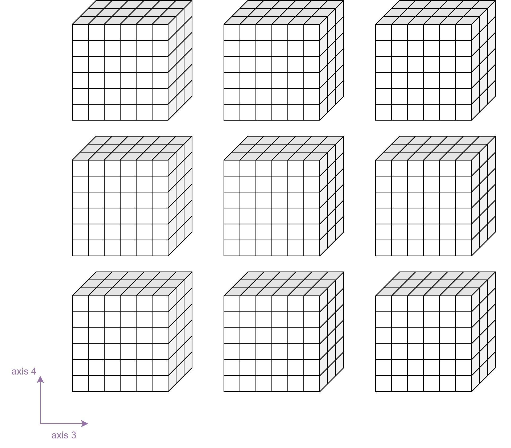
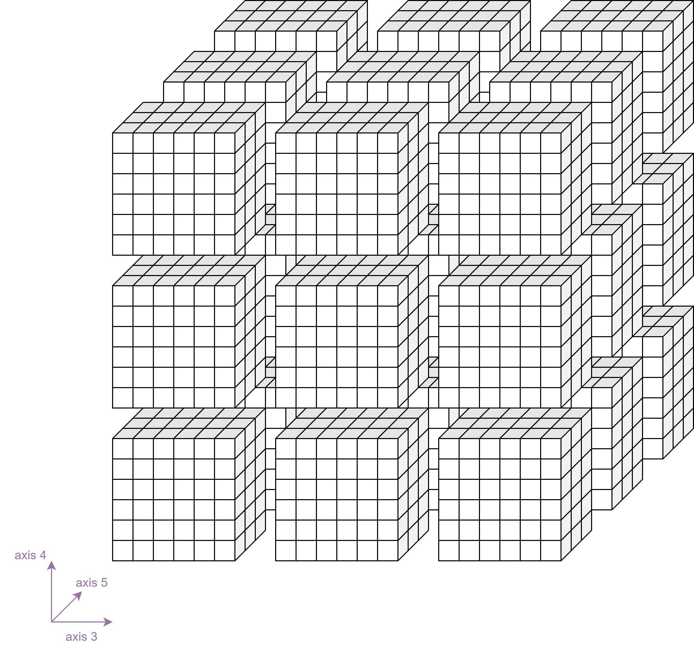

# Vectors, Matrices and Tensors

## Vectors

In calculus, a vector is a mathematical object that represents both magnitude and direction. It is often used to describe quantities that have both size and direction, such as velocity, force, or displacement.

A vector in calculus is typically represented by an arrow or a boldface letter, such as v. The magnitude of a vector v is denoted by ||v|| or simply v, and it represents the length or size of the vector. The direction of the vector is indicated by the orientation of the arrow or by specifying the coordinates of its endpoints.

In a two-dimensional space, a vector can be represented as an ordered pair of numbers (x, y), where x represents the horizontal component (also called the x-component or the i-component), and y represents the vertical component (also called the y-component or the j-component). This is known as the Cartesian representation of a vector.

In a three-dimensional space, a vector can be represented as an ordered triple of numbers (x, y, z), where x, y, and z represent the components along the x, y, and z axes, respectively. This is known as the Cartesian representation of a vector in three dimensions.

Vectors can be added, subtracted, and multiplied by scalars (real numbers). The addition of vectors follows the parallelogram law, where the sum of two vectors is obtained by placing the initial point of the second vector at the terminal point of the first vector, and the sum is the vector extending from the initial point of the first vector to the terminal point of the second vector.

Vectors can also be multiplied by scalars, resulting in a vector that has the same direction but a scaled magnitude. This operation is known as scalar multiplication.

In calculus, vectors are used to describe rates of change, such as velocity and acceleration, as well as to represent the direction and gradient of functions. They play a fundamental role in vector calculus, which extends the concepts of calculus to vector-valued functions and vector fields.

In data science a sigle data point is usually described as a vector. The number of components of teh vector corresponds with the number of features your dataset has, i.e. if you have a dataset about persons containing the features 'name', 'age', 'profession' and 'salary' you would need a vector with four components: x = (x1, x2, x3, x4).

## Matrices

In mathematics, a matrix is a rectangular array of numbers, symbols, or expressions arranged in rows and columns. It is often used to represent a set of linear equations, perform transformations, or store data in various applications.

A matrix is denoted by a capital letter, typically boldface, such as A. The size or dimensions of a matrix are given by the number of rows and columns it contains. For example, a matrix with m rows and n columns is said to have a size of m x n. The individual elements of a matrix are usually identified by their position within the array using subscripts. For instance, the element in the i-th row and j-th column of a matrix A is typically denoted as aᵢⱼ.

In data science tabular data is described with a matrix. Each row represents a data point in the dataset while the columns represent the features of your data.

## Tensors

In mathematics, a tensor is a mathematical object that generalizes the concepts of scalars, vectors, and matrices to higher dimensions. It is a multidimensional array of numbers.

In data science you need tensors if the data itself is multidimensional. For example images are usually described by a 3D tensor. The first two dimensions represent the width and the height of the image, the third dimension represents the three color channels (red, green, blue).

## High-dimensional tensors

### 4D tensors

Tensors are not limited in their dimensionality. In machine learning, especially in deep learning we often use high dimensional tensors to represent our data. For example if we want to train a deep neural network for image classification we need to introduce a fourth dimension for our batch size, because the images themselfs already need three dimensions. We can think of fourdimensional tensors as placing cubes in a row. The first cube would be the first image, the cube next to it the second image and so on. Also a video, which is technically a series of images (or frames) can be represented by a 4D tensor.

### 5D tensors

When dealing with video data we even need an additional dimension, because videos itself have four dimensions (width, height, color channels and time). We can think of 5D tensors by placing cubes in a grid. Each grid column represents a single video. Each cube in a row represents a single frame of a video.

### 6D tensors

Sometimes even more than five dimensions are needed for representing our data. An example of 6D input data would be if we would split our videos into multiple short videos. We need one more exis to represent the number of video snippets of our input data. We can visualize 6D tensors as a cube of cubes like it is shown in the following diagram. Axis 3 would represent a single video snippet. A complete video would be represented by axis 3 and axis 4, where each row is a video snippet and the 2D grid represents the complete video. A batch of videos would be represented by stacking multiple 2D grids. The result would be a 3D grid where each cell contains a 3D tensor.

### ND tensors

We could continue this schema for representing even higherdimensional tensors. A ND tensor would be a cube of cubes of cubes of cubes and so on. But you see its get's quite confusing if the dimension of tensors grow.
