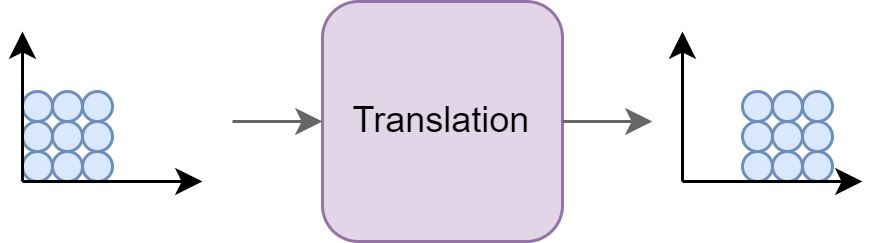
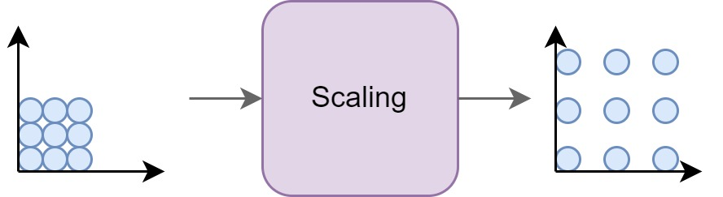
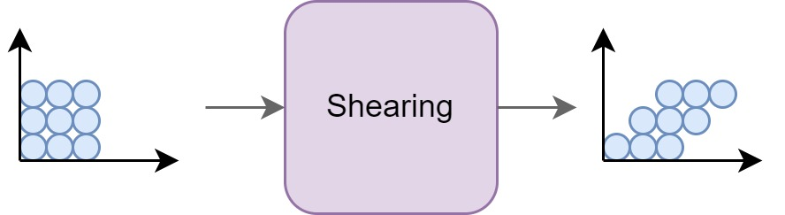
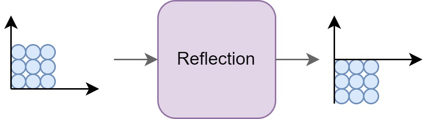
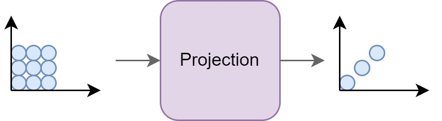

# The power of matrix computation

Matrices can be used to perform various geometrical transformations on vectors or points in space. Here are some common geometrical transformations that can be achieved using matrices:

### Translation

Translation involves shifting an object or a point in space by a certain distance in the x, y, and/or z directions. It can be represented using a translation matrix, where the matrix elements correspond to the amount of translation in each direction. For example, a 2D translation matrix for shifting by (tx, ty) would be:

| 1 0 tx |
| 0 1 ty |
| 0 0 1 |

### Scaling

Scaling modifies the size of an object or a point. It can be uniformly applied to all dimensions or independently along each axis. Scaling is represented using a scaling matrix, where the diagonal elements represent the scaling factors. For example, a 2D scaling matrix for scaling by (sx, sy) would be:

| sx 0 |
| 0 sy |

### Rotation

Rotation transforms an object or a point around a fixed point or the origin. Rotations can be performed in 2D or 3D space and are typically specified by an angle of rotation or rotation matrix. For example, a 2D rotation matrix for rotating by an angle θ would be:

| cos(θ) -sin(θ) |
| sin(θ) cos(θ) |

### Shearing

Shearing is a transformation that skews an object or a point in a specified direction. It can be applied along one or more axes. Shearing is represented using a shearing matrix, where the matrix elements control the amount of shearing in each direction.

### Reflection

Reflection flips an object or a point across a line or plane. It can be performed along an axis or an arbitrary line. Reflection can be represented using a reflection matrix, which depends on the line or plane of reflection.

### Projection

Projection transforms 3D points onto a 2D plane or a lower-dimensional subspace. It is commonly used in computer graphics and computer vision. Projection matrices can be used to project objects or points onto a desired plane or subspace.

These transformations can be combined by multiplying the corresponding transformation matrices together. By applying these matrices to vectors or points, you can achieve a wide range of geometrical transformations in 2D or 3D space.
