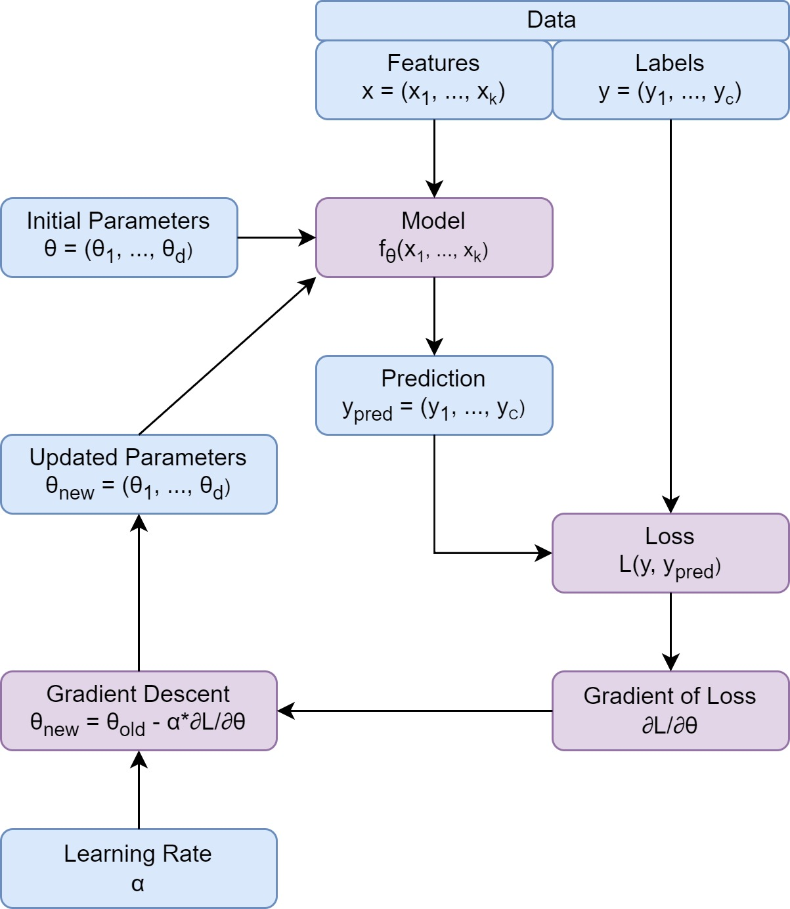

# Derivatives, Gradients and the Gradient Descent Algorithm

In mathematics, a derivative is a fundamental concept in calculus that measures the rate of change of a function with respect to its independent variable. It provides information about how a function behaves locally around a particular point. The derivative of a function f(x) is denoted by f'(x), ∂y/∂x or dy/dx, where _y_ represents the dependent function / variable and _x_ represents the independent variable.

Geometrically, the derivative can be interpreted as the slope of the tangent line to the graph of the function at a given point. If the derivative is positive at a point, it indicates that the function is increasing at that point. Conversely, if the derivative is negative, the function is decreasing. A derivative of zero suggests a horizontal tangent, which typically occurs at the maximum or minimum points of a function.

The derivative can be computed using various methods, depending on the complexity of the function. For simple functions, there are basic rules that can be applied, such as the power rule, product rule, quotient rule, and chain rule. These rules allow you to find the derivative of more complex functions by breaking them down into simpler components.

Derivatives have numerous applications in mathematics, physics, engineering, economics, and other fields. They are used to solve optimization problems, analyze rates of change, model physical phenomena, and much more.

## The constants rule

The derivative of a constant is always zero. This rule holds true in calculus, as the derivative measures the rate of change of a function. Since a constant value does not change as the input variable varies, its derivative is always zero.

Mathematically, if we have a constant value C, then the derivative of C with respect to any variable x is given by:

```
d/dx (C) = 0
```

This implies that regardless of the form of the constant or the variable with respect to which we are taking the derivative, the result will always be zero.

For example, let's consider the constant function _f(x) = 5_. Taking the derivative of this function with respect to x yields:

```
d/dx (5) = 0
```

Similarly, if we have a constant value in an expression involving other variables, the derivative of that expression with respect to any variable will still be zero for the constant term.

For example, if we have the function _g(x) = 3x^2 + 7_, the derivative with respect to x is:

```
d/dx (3x^2 + 7)
= d/dx (3x^2) + d/dx (7)
= 6x + 0
= 6x
```

As you can see, the derivative of the constant term _7_ is zero, and it does not contribute to the rate of change of the function.

In summary, when computing derivatives, constants are treated as terms that do not change and have no impact on the rate of change of a function. Therefore, their derivative is always zero.

## The sum rule

The sum rule, also known as the rule of linearity, is a basic rule in calculus that allows you to find the derivative of a sum of functions. Mathematically, the sum rule states that if you have two functions, f(x) and g(x), and you want to find the derivative of their sum, denoted as (f(x) + g(x)), then the derivative of the sum is equal to the sum of the derivatives of the individual functions. Symbolically, it can be expressed as:

```
[f(x) + g(x)]' = f'(x) + g'(x)
```

In other words, to apply the sum rule, you can differentiate each function separately and then add the derivatives together.

Here are a few examples to illustrate the sum rule:

1. If f(x) = 2x and g(x) = 3x^2, the derivative of their sum is:

   ```
   [f(x) + g(x)]'
   = (2x)' + (3x^2)'
   = 2 + 6x = 6x + 2
   ```

2. If h(x) = sin(x) and k(x) = cos(x), the derivative of their sum is:

   ```
   [h(x) + k(x)]'
   = (sin(x))' + (cos(x))'
   = cos(x) - sin(x)
   ```

3. If p(x) = 4x^3 - 2x^2 + 5x and q(x) = 2x - 1, the derivative of their sum is:
   ```
   [p(x) + q(x)]'
   = (4x^3 - 2x^2 + 5x)' + (2x - 1)'
   = 12x^2 - 4x + 5 + 2
   = 12x^2 - 4x + 7
   ```

The sum rule can be extended to cases where you have more than two functions being added together. You simply differentiate each function separately and sum up their derivatives.

## The power rule

The power rule is a basic rule in calculus that allows you to find the derivative of a function that is raised to a constant power. Mathematically, the power rule states that if you have a function of the form _f(x) = x^n_, where n is a constant, then its derivative, denoted as _f'(x)_ or _dy/dx_, is given by:

```
f'(x) = n * x^(n-1)
```

In other words, to apply the power rule, you bring down the exponent as a coefficient and reduce the exponent by 1.

Here are a few examples to illustrate the power rule:

1. If f(x) = x^2, the derivative f'(x) is calculated as follows:
   ```
   f'(x) = 2x^(2-1) = 2x^1 = 2x
   ```
2. If g(x) = x^3, the derivative g'(x) is:
   ```
   g'(x) = 3x^(3-1) = 3x^2 = 3x^2
   ```
3. If h(x) = x^(-2), the derivative h'(x) is:
   `` h'(x) = -2x^(2-1) = -2x^(-3)```
   It's important to note that the power rule applies when the exponent is a constant. If the exponent itself depends on _x_ (i.e., it's a function of _x_), then you would need to use the chain rule to differentiate the function.

## The product rule

The product rule is a fundamental rule in calculus that allows you to find the derivative of the product of two functions. Mathematically, the product rule states that if you have two functions, f(x) and g(x), and you want to find the derivative of their product, denoted as (f(x) \* g(x)), then the derivative of the product is calculated as follows:

```
(f(x) * g(x))' = f'(x) * g(x) + f(x) * g'(x)
```

In other words, to apply the product rule, you differentiate the first function and multiply it by the second function, then add it to the product of the first function and the derivative of the second function.

Here are a few examples to illustrate the product rule:

1. If f(x) = x^2 and g(x) = 3x, the derivative of their product is:
   ```
   (f(x) * g(x))'
   = (x^2)' * (3x) + (x^2) * (3x)'
   = 2x * 3x + x^2 * 3
   = 6x^2 + 3x^2
   = 9x^2
   ```
2. If h(x) = sin(x) and k(x) = cos(x), the derivative of their product is:
   ```
   (h(x) * k(x))'
   = (sin(x))' * (cos(x)) + (sin(x)) * (cos(x))'
   = cos(x) * cos(x) - sin(x) * sin(x) = cos^2(x) - sin^2(x)`
   ```
3. If p(x) = 2x^3 and q(x) = x^2 + 1, the derivative of their product is:
   ```
   (p(x) * q(x))'
   = (2x^3)' * (x^2 + 1) + (2x^3) * (x^2 + 1)'
   = 6x^2 * (x^2 + 1) + 2x^3 * 2x
   = 6x^4 + 6x^2 + 4x^4
   = 10x^4 + 6x^2
   ```

The product rule is particularly useful when dealing with functions that involve multiplication, such as polynomial expressions or trigonometric functions multiplied together. By employing the product rule, you can find the derivative of the product function without having to expand or distribute the terms.

## The quotient rule

The quotient rule is a fundamental rule in calculus that allows you to find the derivative of a function that is expressed as the quotient of two functions. Mathematically, the quotient rule states that if you have two functions, f(x) and g(x), and you want to find the derivative of their quotient, denoted as (f(x) / g(x)), then the derivative of the quotient is calculated as follows:

```
(f(x) / g(x))' = (f'(x) * g(x) - f(x) * g'(x)) / [g(x)]^2
```

In other words, to apply the quotient rule, you differentiate the numerator, multiply it by the denominator, then subtract the product of the numerator and the derivative of the denominator. Finally, divide the whole expression by the square of the denominator.

Here are a few examples to illustrate the quotient rule:

1. If f(x) = 3x and g(x) = x^2, the derivative of their quotient is:

   ```
   (f(x) / g(x))' = [(3x)' * (x^2) - (3x) * (x^2)'] / [(x^2)]^2
   = [3 * x^2 - 3x * 2x] / [x^4]
   = (3x^2 - 6x^2) / x^4
   = -3x^2 / x^4
   = -3 / x^2
   ```

2. If h(x) = sin(x) and k(x) = cos(x), the derivative of their quotient is:

   ```
   (h(x) / k(x))' = [(sin(x))' * (cos(x)) - (sin(x)) * (cos(x))'] / [(cos(x))]^2
   = [cos(x) * cos(x) - sin(x) * (-sin(x))] / [cos^2(x)]
   = [cos^2(x) + sin^2(x)] / [cos^2(x)]
   = 1 / cos^2(x)
   ```

3. If p(x) = 2x^3 and q(x) = x^2 + 1, the derivative of their quotient is:
   ```
   (p(x) / q(x))' = [(2x^3)' * (x^2 + 1) - (2x^3) * (x^2 + 1)'] / [(x^2 + 1)^2]
   = [6x^2 * (x^2 + 1) - 2x^3 * 2x] / [(x^2 + 1)^2]
   = [6x^4 + 6x^2 - 4x^4] / [(x^2 + 1)^2]
   = (2x^4 + 6x^2) / [(x^2 + 1)^2]
   ```

The quotient rule is especially useful when dealing with functions that involve division, such as rational functions. It allows you to find the derivative of the quotient without having to expand or simplify the expression explicitly.

## The chain rule

The chain rule is a fundamental rule in calculus that allows you to find the derivative of a composite function. A composite function is a function that is formed by applying one function to the output of another function. The chain rule enables us to differentiate such functions.

Mathematically, let's say you have a composite function _y_ = f(g(x)), where g(x) is an inner function and f(u) is an outer function. The chain rule states that the derivative of _y_ with respect to x, denoted as dy/dx or y', can be calculated as follows:

```
dy/dx = (df/du) * (dg/dx)
```

In other words, the derivative of the composite function is the product of the derivative of the outer function with respect to its variable (u) and the derivative of the inner function with respect to its variable (x).

To apply the chain rule, you typically follow these steps:

Identify the outer function (f(u)) and the inner function (g(x)) within the composite function.
Differentiate the outer function with respect to its variable (u), which gives you (df/du).
Differentiate the inner function with respect to its variable (x), which gives you (dg/dx).
Multiply (df/du) by (dg/dx) to obtain the derivative of the composite function, dy/dx.
Here's an example to illustrate the chain rule:

Let's consider the function _y_ = (2x + 1)^3. We can break it down as the composite function _y_ = f(g(x)), where g(x) = 2x + 1 and f(u) = u^3.

Identify the outer function (f(u) = u^3) and the inner function (g(x) = 2x + 1).
Differentiate the outer function with respect to its variable (u), which gives you (df/du) = 3u^2.
Differentiate the inner function with respect to its variable (x), which gives you (dg/dx) = 2.
Multiply (df/du) by (dg/dx) to obtain the derivative of the composite function, dy/dx:
dy/dx = (df/du) \* (dg/dx) = 3(2x + 1)^2 \* 2 = 6(2x + 1)^2.
So, the derivative of _y = (2x + 1)^3_ with respect to _x_ is dy/dx = 6(2x + 1)^2.

The chain rule is a powerful tool in calculus and is used extensively in various applications, such as in physics, engineering, and optimization problems, where functions involve nested operations or compositions.

# Partial derivatives

In calculus, a partial derivative is a type of derivative that measures how a function changes with respect to one of its variables while holding the other variables constant. It is used when dealing with functions of multiple variables.

Let's consider a function _f(x, y)_ that depends on two variables, _x_ and _y_. The partial derivative of _f_ with respect to _x_, denoted as ∂f/∂x or fₓ, represents how _f_ changes with respect to changes in _x_ while keeping _y_ constant. Similarly, the partial derivative of _f_ with respect to _y_, denoted as _∂f/∂y_ or _fᵧ_, represents how _f_ changes with respect to changes in _y_ while keeping _x_ constant.

The notation for partial derivatives is similar to that of ordinary derivatives. To calculate a partial derivative, you differentiate the function with respect to the specific variable while treating the other variables as constants.

For example, let's consider the function _f(x, y) = x^2 + 3xy_. To find the partial derivative of _f_ with respect to _x_, we differentiate _f_ with respect to _x_ while treating _y_ as a constant:

```
∂f/∂x = (∂/∂x) (x^2 + 3xy) = 2x + 3y.
```

Similarly, to find the partial derivative of _f_ with respect to _y_, we differentiate _f_ with respect to _y_ while treating _x_ as a constant:

```
∂f/∂y = (∂/∂y) (x^2 + 3xy) = 3x.
```

The partial derivatives allow us to understand how changes in one variable affect the function while keeping the other variables constant. They are essential in various fields, including physics, economics, engineering, and optimization problems, where functions depend on multiple variables.

It is worth noting that if a function is differentiable with respect to each of its variables, the partial derivatives will determine the gradient of the function, which was discussed in the previous question.

# The gradient

In mathematics, the gradient is a concept that is widely used in calculus and vector calculus. It represents the direction and magnitude of the steepest ascent of a function at a particular point.

Formally, the gradient of a scalar-valued function f(x, _y_, z) in three-dimensional space is denoted as ∇f or grad(f) and can be represented as a vector. The gradient vector is defined as:

```
∇f = (∂f/∂x, ∂f/∂y, ∂f/∂z)
```

Here, ∂f/∂x, ∂f/∂y, and ∂f/∂z represent the partial derivatives of the function f(x, _y_, z) with respect to each of the variables x, _y_, and z, respectively. The gradient vector points in the direction of the greatest rate of increase of the function, and its magnitude indicates the steepness of the function in that direction.

Similarly the gradient of an n-dimensional function _f(x1, x2, ..., xn)_ is defined in the following way:

```
∇f = (∂f/∂x1, ∂f/∂x2, ..., ∂f/∂xn)
```

Intuitively, you can think of the gradient as a vector that points toward the direction of the steepest uphill slope on a surface defined by the function. At any given point on the surface, the gradient vector points in the direction of the tangent line that best approximates the slope of the surface.

The gradient is a fundamental concept used in various areas, including optimization problems, vector calculus, physics, and machine learning. It is particularly useful in optimization algorithms where the goal is to find the minimum or maximum of a function. By following the direction of the gradient, one can iteratively approach the optimal solution. This is how we optimize the parameters of neural networks.

# The Gradient Descent Algorithm

The gradient descent algorithm is an iterative optimization algorithm used to minimize a function iteratively. It is commonly employed in machine learning and optimization problems to find the minimum of a cost or objective function.

Here's a step-by-step explanation of the gradient descent algorithm:

1. **_Initialization_**: Choose an initial point in the parameter space. This could be done randomly or based on prior knowledge.

2. **_Compute the Gradient_**: Calculate the gradient (or partial derivatives) of the cost or objective function with respect to each parameter. The gradient represents the direction of the steepest ascent in the function space.

3. **_Update the Parameters_**: Update the values of the parameters by taking a step proportional to the negative gradient. The updating equation is typically of the form:
   `θ_new = θ_old - learning_rate * gradient`,
   where _θ_new_ and _θ_old_ represent the new and old parameter values, respectively, and the learning_rate (often denoted as alpha) is a hyperparameter that determines the step size.

Repeat Steps 2 and 3: Repeat steps 2 and 3 until convergence or a stopping criterion is met. The stopping criterion can be based on the number of iterations, reaching a certain threshold for the cost function, or other criteria specific to the problem.

The algorithm iteratively adjusts the parameter values in the direction of steepest descent, allowing it to gradually converge towards the minimum of the cost function. By following the negative gradient, the algorithm moves in the direction of decreasing function values, which corresponds to descending down the slope of the function.

The learning rate is a crucial hyperparameter in gradient descent. It determines the step size taken in each iteration. A large learning rate may result in overshooting the minimum, causing the algorithm to diverge. On the other hand, a small learning rate may slow down convergence.

There are variations of gradient descent, such as batch gradient descent, stochastic gradient descent, and mini-batch gradient descent, which differ in how they update the parameters using the gradient. These variations are often used to balance computational efficiency and convergence accuracy.

Overall, the gradient descent algorithm provides an iterative approach to optimize a function by iteratively updating parameters in the direction of steepest descent. It is a fundamental optimization technique used in various machine learning algorithms, such as linear regression, logistic regression, and neural networks.



There is a very good video on YouTube by _Emergent Garden_ which shows multiple exampled how a neural network learns by feeding in with data and what difficulties can occur during the learning process. Also neural networks are compared to other approximation techniques like Taylor Series.

<iframe width="560" height="315" src="https://www.youtube.com/embed/TkwXa7Cvfr8?si=GHPTv4h_hlJFepTv" title="YouTube video player" frameborder="0" allow="accelerometer; autoplay; clipboard-write; encrypted-media; gyroscope; picture-in-picture; web-share" allowfullscreen></iframe>
