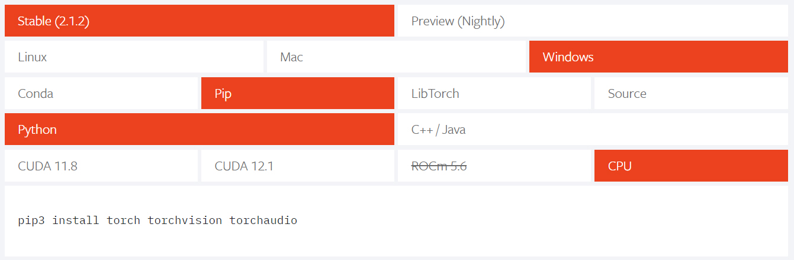

# PyTorch Installation

The main framework we are using in this course is PyTorch. You can install PyTorch via the Python PIP package manager. Visit the <a href="https://pytorch.org" target="_blank">PyTorch website</a> the find the installation command. You will see that you have several parameters for your PyTorch installation you can choose:



### PyTorch Installation Options

**_PyTorch Version_**

The stable and preview versions of PyTorch differ in terms of their release cycles and the level of stability they offer.

Stable Version: The stable version of PyTorch is the recommended version for most users, especially those who prioritize stability and production-readiness. This version goes through rigorous testing and bug-fixing processes, and it is intended for use in production environments where reliability is crucial. The stable version is well-tested, thoroughly documented, and is expected to have fewer bugs and issues compared to the preview version.

Preview Version: The preview version of PyTorch, also known as the nightly build or the development version, is the bleeding-edge version that contains the latest features, bug fixes, and enhancements. This version is primarily aimed at developers and researchers who want to experiment with the newest capabilities and provide feedback to the PyTorch development team. While the preview version offers access to the latest advancements in PyTorch, it may not be as stable and could potentially have more bugs or compatibility issues compared to the stable version.

The choice between the stable and preview versions depends on your specific requirements and use case. If you are working on a production project or require a stable and reliable framework, it is generally recommended to go with the stable version. On the other hand, if you are an advanced user or want to experiment with the latest features, you can opt for the preview version. However, keep in mind that the preview version may have some instability issues, and it is important to be prepared for potential bugs or changes in functionality.

You should use the stable version if there is no need for installing the preview version.

**_Operating System_**

PyTorch is available for Linux, Mac and Windows. Choose the operating system you want to install PyTorch on in the second row.

**_Package Manager_**

In the third row you can choose the package manager you want to use for installong PyTorch. Usually we use pip or conda. It depends which package manager is installed on your system.

**_Programming Language_**

PyToorch is originally written in C/C++, however there are several programming languages such as Python or Java that provide a high level API to the underlying code. In this course we will use Python.

**_CPU, CUDA and ROCm_**

The CUDA, ROCm, and CPU versions of PyTorch are different variants of the framework that are optimized for specific hardware configurations. Here's an overview of each version:

CUDA Version: The CUDA version of PyTorch is designed to leverage NVIDIA GPUs (Graphics Processing Units) through the CUDA parallel computing platform. CUDA provides a programming model and API for general-purpose computing on NVIDIA GPUs, allowing PyTorch to accelerate computations and take advantage of GPU parallelism. If you have an NVIDIA GPU in your system and want to utilize its computing power for faster training and inference, you should choose the CUDA version. It requires installing the CUDA Toolkit and appropriate GPU drivers.

ROCm Version: The ROCm (Radeon Open Compute) version of PyTorch is aimed at AMD GPUs. ROCm is an open-source platform for GPU computing that supports AMD GPUs and provides similar capabilities as CUDA for NVIDIA GPUs. If you have an AMD GPU and want to utilize it with PyTorch, you should choose the ROCm version. It requires installing the ROCm platform and appropriate GPU drivers.

CPU Version: The CPU version of PyTorch is designed to run on CPUs (Central Processing Units) without any GPU acceleration. If you don't have a compatible GPU or if you prefer to run PyTorch solely on your CPU, you should choose the CPU version. While the CPU version may not offer the same level of computational speed as GPU-accelerated versions, it is still capable of running PyTorch code and can be useful for development, testing, or running smaller models where GPU acceleration is not necessary.

When deciding which version to install, consider the hardware resources available to you. If you have an NVIDIA GPU, the CUDA version is typically the best choice for maximizing performance. If you have an AMD GPU, the ROCm version is the appropriate option. If you don't have a compatible GPU or if you want to run PyTorch on your CPU, the CPU version is suitable.

It's also worth noting that PyTorch supports mixed precision training, which allows you to leverage both CPU and GPU resources. This means you can use a combination of CPU and GPU for different parts of your computation, depending on their respective strengths and memory capacities.

You should install the CPU version by default. If you are using a Gaming Laptop that has an Nvidia GPU built in you should install teh CUDA version. If the Laptop has an AMD GPU built in use the ROCm version.

## Other libraries that are needed

PyTorch is often used in combination with other data science libraries like Numpy, Pandas or Matplotlib. For this course execute the following command to install these libraries:

```bash
$ pip install numpy pandas matplotlib seaborn
```
